### 1 Credit Assignments

> [!NOTE]
> Pls edit this table while submitting the assignments

| Status         | Questions     | 
|----------------|---------------|
| <ul><li>- [x] </li></ul> | Install the below mentioned tools/tech/framwork & add the screenshot |
| <ul><li>- [ ] </li></ul> | [Accounts] Create the accounts and add the screenshot here |
| <ul><li>- [ ] </li></ul> | [React] Create a basic hello-world app using "Create React App" and push the same to github repo. Add the screenshots of the steps & the URL of that repo |
| <ul><li>- [ ] </li></ul> | [Github Actions] Create a Github Actions pipeline to deploy the app in GitHub Pages |
| <ul><li>- [ ] </li></ul> | [AWS] Create the below mentioned AWS services |
| <ul><li>- [ ] </li></ul> | [AWS] Deploy the app in S3 and access via CloudFront in manual way  |
| <ul><li>- [ ] </li></ul> | [Github Actions] Create a Github Actions pipeline to deploy the app in AWS (S3 + CloudFront)  |
| <ul><li>- [ ] </li></ul> | [Impromptu Learning] Write a Dev.to post for the given tool  |
| <ul><li>- [ ] </li></ul> | [Homework] Create the similar pipeline for the repo : https://github.com/SanthoshNC/developer-cards-react-app  |

***

### 1 Credit Assignments - Answers and Screenshots

> [!WARNING]
> Pls submit the correct screenshots

> [!CAUTION]
> Pls don't copy from others. Marks will be reduced for both students

#### #1 Install the below mentioned tools/tech/framwork & add the screenshot:
	- NodeJS 
	- NPM 
	- Git
	- VSCode
> Tools 
  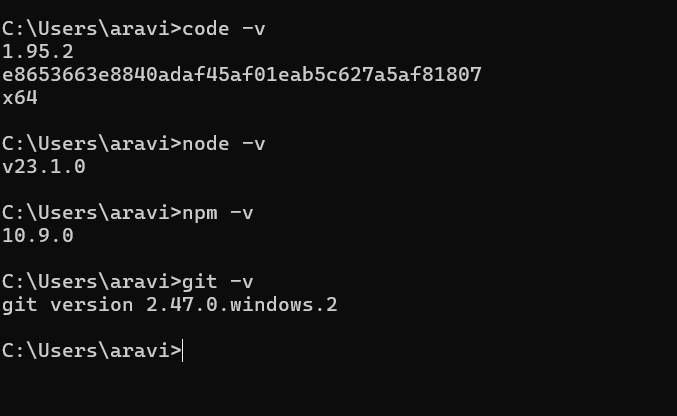

#### #2 [Accounts] Create the accounts and add the screenshot here
	- GitHub (with Personal Mail ID)
	- AWS Free Tier Account (with Personal Mail ID)
	- Dev.to (with Personal Mail ID)
> Github Account 
  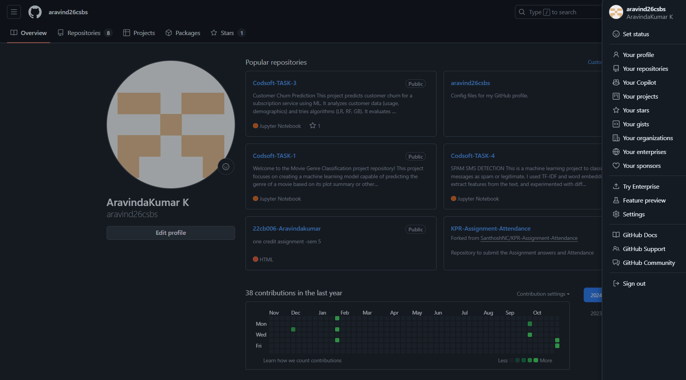
  AWS Account 
  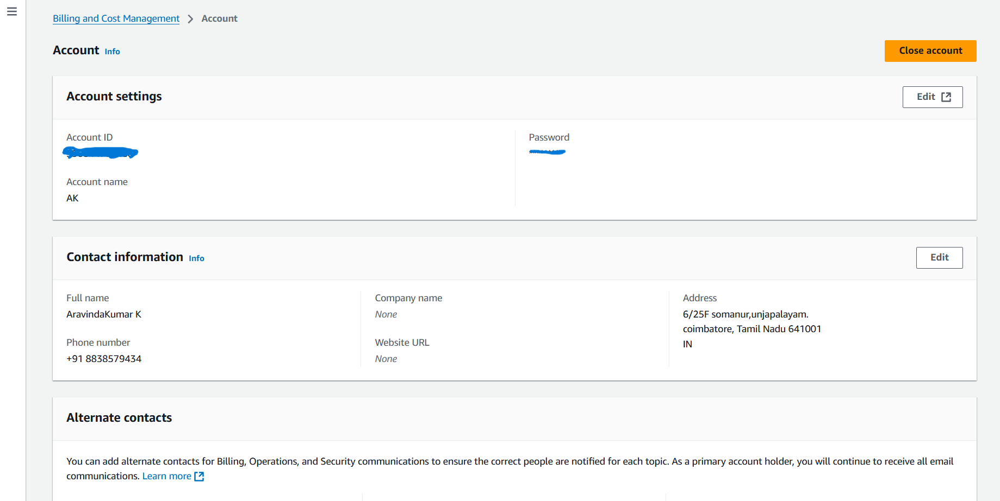
  Dev.to Account
  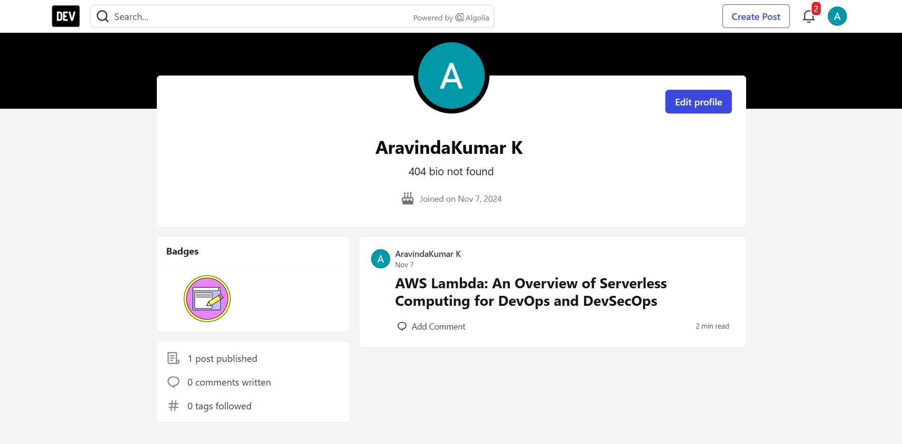

#### #3 [React] Create a basic hello-world app using "Create React App" and push the same to github repo. Add the screenshots of the steps & the URL of that repo
>React App command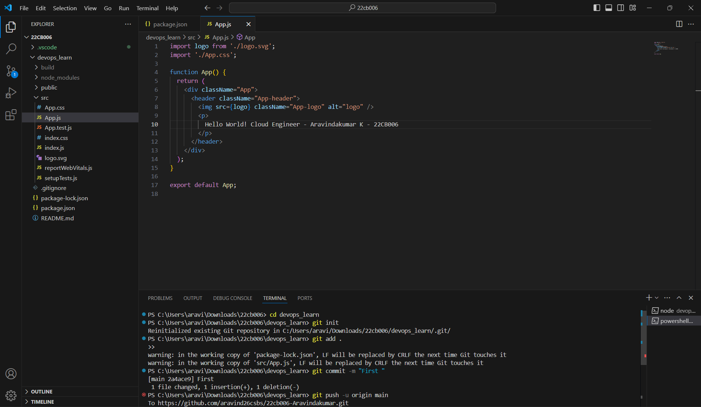

 React App 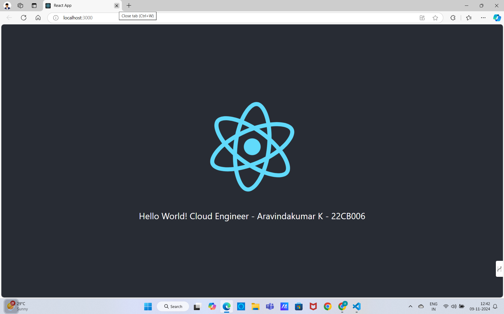

#### #4 [Github Actions] Create a Github Actions pipeline to deploy the app in GitHub Pages
> code
  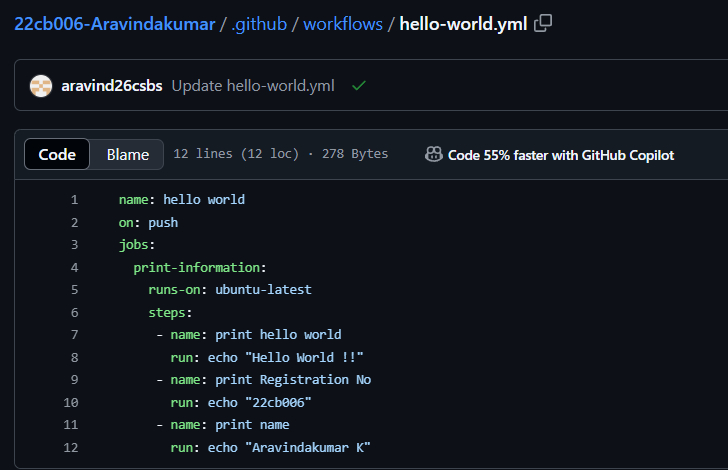
  code
  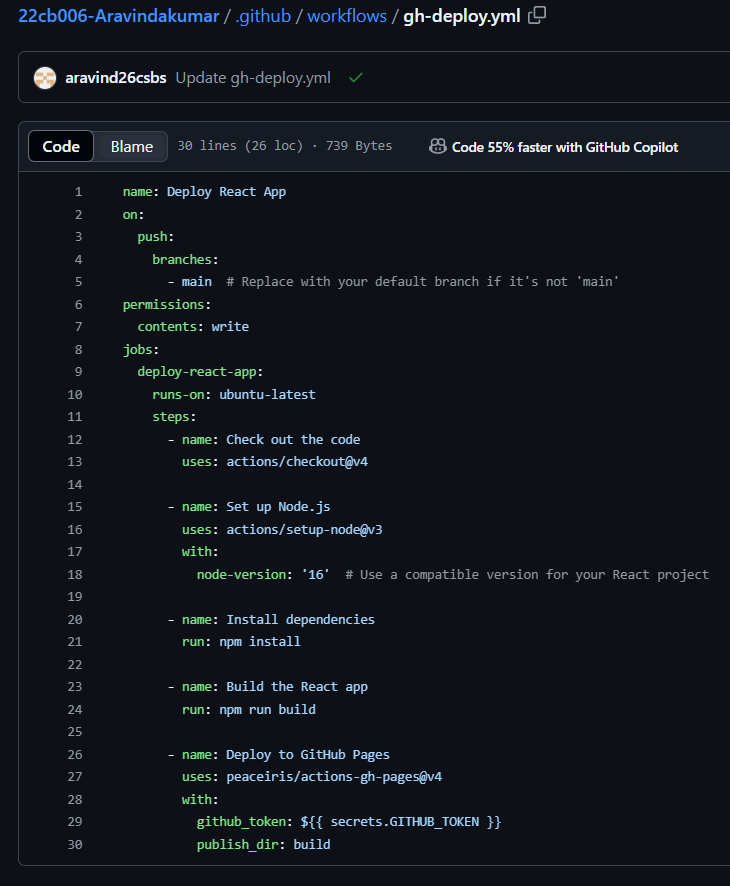
  Deployed
  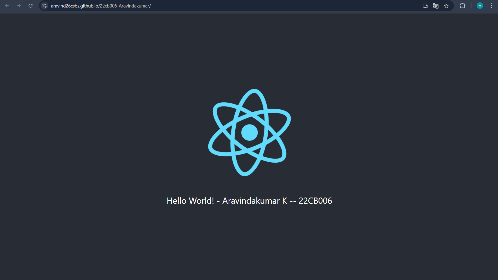

#### #5 [AWS] Create the below mentioned AWS services
	- IAM
	- S3
	- CloudFront
> Github-Iam
  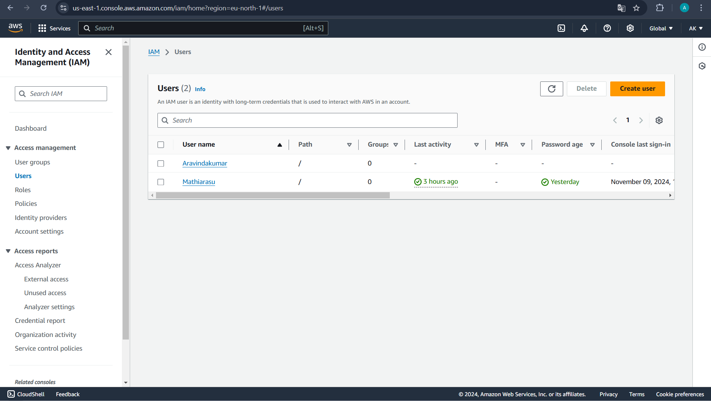
  Github-S3
  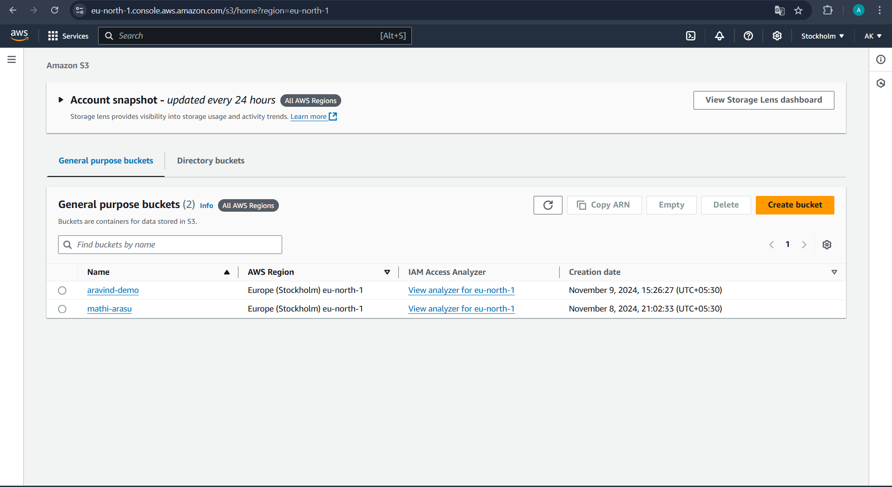

#### #6 [AWS] Deploy the app in S3 and access via CloudFront in manual way
> Deployed using AWS S3
  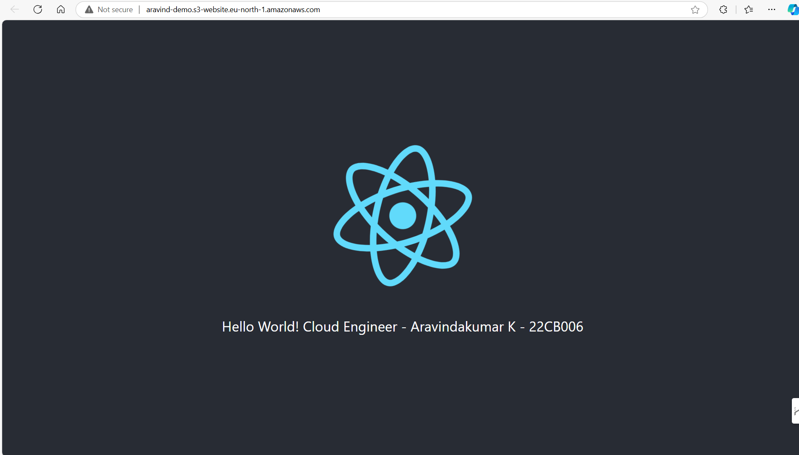
  S3-URL
  http://aravind-demo.s3-website.eu-north-1.amazonaws.com

#### #7 [Github Actions] Create a Github Actions pipeline to deploy the app in AWS (S3 + CloudFront)
> Add your answer here!

***

#### #8 [Impromptu Learning] Write a Dev.to post for the given tool:
	- DevSecOps Periodic Table
	- Rules:
		Overview of the Tool
		Key Features
		How It Fits into DevOps/DevSecOps
		Programming Langauage
		Parent Company of that tool
		Whether it is open source or paid one
		Icon / Logo
> Overview of the AWS Lambda Tool
  
  Article-URL
  https://dev.to/aravind_04/aws-lambda-an-overview-of-serverless-computing-for-devops-and-devsecops-23nb

#### #9 [Homework] Create the similar pipeline for the repo : https://github.com/SanthoshNC/developer-cards-react-app
	- Github Repo URL
	- Github Actions Pipeline for Github Pages
	- Github Pages URL
 	- Github Actions for S3
 	- AWS CloudFront URL

> Github URL:
https://github.com/aravind26csbs/developer-cards-react-app.git
   
   Github Actions Pipeline:
   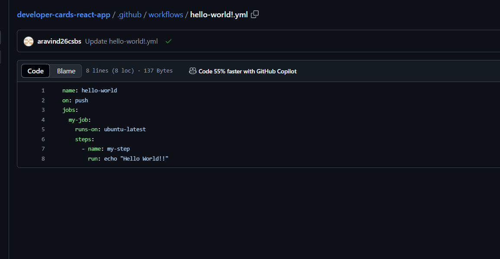

   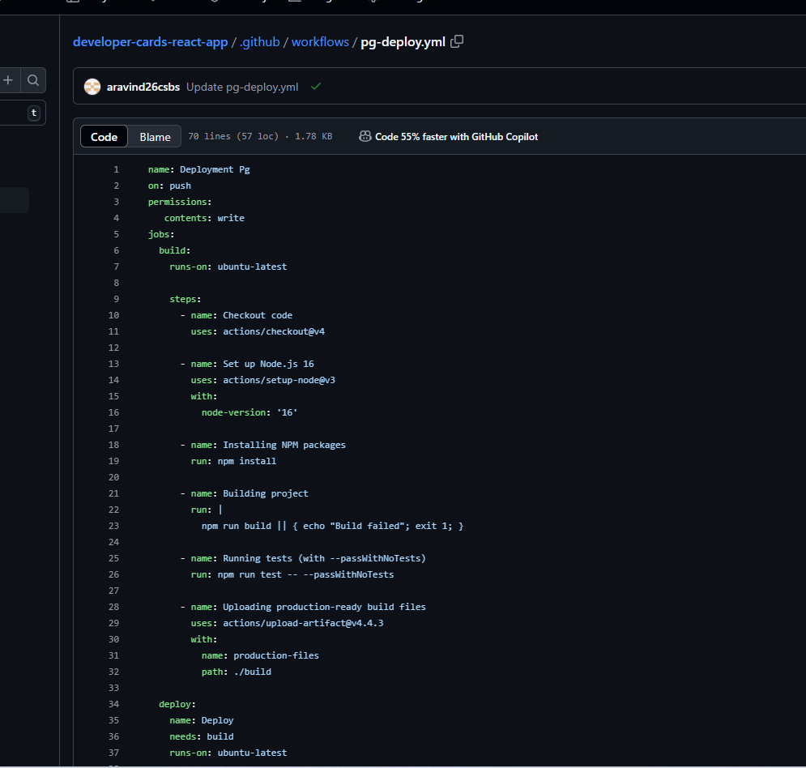
    
    Github Page
   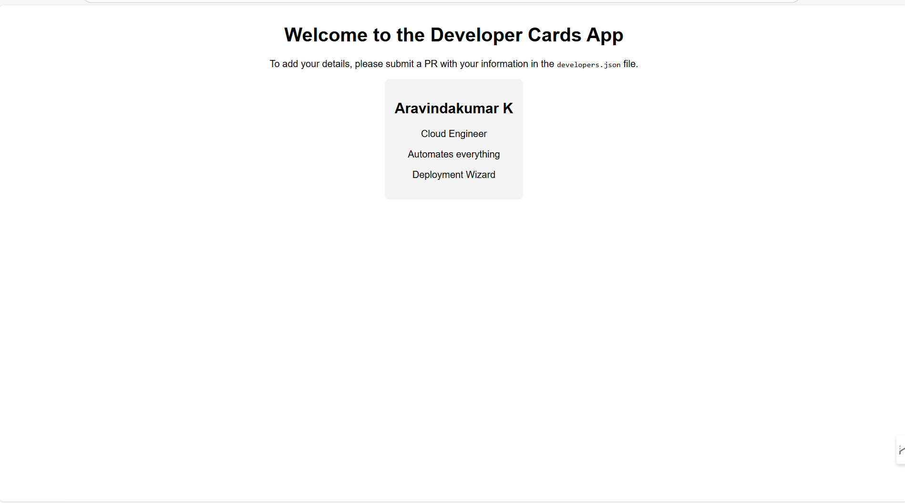

	Github Actions for S3 URL:
   