### 1 Credit Assignments

> [!NOTE]
> Pls edit this table while submitting the assignments

| Status         | Questions     | 
|----------------|---------------|
| <ul><li>- [✅] </li></ul> | Install the below mentioned tools/tech/framwork & add the screenshot |
| <ul><li>- [✅] </li></ul> | [Accounts] Create the accounts and add the screenshot here |
| <ul><li>- [✅] </li></ul> | [React] Create a basic hello-world app using "Create React App" and push the same to github repo. Add the screenshots of the steps & the URL of that repo |
| <ul><li>- [✅] </li></ul> | [Github Actions] Create a Github Actions pipeline to deploy the app in GitHub Pages |
| <ul><li>- [✅] </li></ul> | [AWS] Create the below mentioned AWS services |
| <ul><li>- [✅] </li></ul> | [AWS] Deploy the app in S3 and access via CloudFront in manual way  |
| <ul><li>- [✅] </li></ul> | [Github Actions] Create a Github Actions pipeline to deploy the app in AWS (S3 + CloudFront)  |
| <ul><li>- [✅] </li></ul> | [Impromptu Learning] Write a Dev.to post for the given tool  |
| <ul><li>- [✅] </li></ul> | [Homework] Create the similar pipeline for the repo : https://github.com/SanthoshNC/developer-cards-react-app  |

***

### 1 Credit Assignments - Answers and Screenshots

> [!WARNING]
> All Answers below are Submited by Mathiarasu R S / 22CB033 🎯

> [!CAUTION]
> Check Out it ✅

#### #1 Install the below mentioned tools/tech/framwork & add the screenshot:
	- NodeJS 
	- NPM 
	- Git
	- VSCode
	
> Tools Screenshots

> TO CHECK VERSIONS OF THE TOOLS  
> node -v
> npm -v
> git -v

>VS CODE DEV TOOL

***

#### #2 [Accounts] Create the accounts and add the screenshot here
	- GitHub (with Personal Mail ID)
	- AWS Free Tier Account (with Personal Mail ID)
	- Dev.to (with Personal Mail ID)

> Accounts Screnshots

>GIT HUB ACCOUNT MATHI

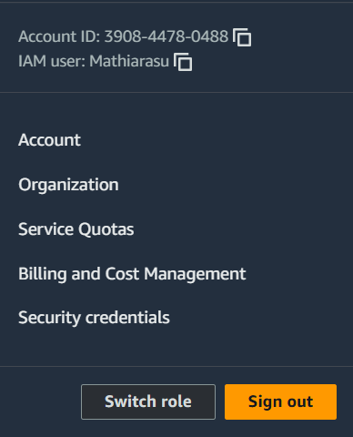
>AWS Account 

>DEV.TO ACCOUNT MATHI

[Visit my Dev.to article about MIRO ](https://dev.to/mathiarasu/miro-kbk)

***

#### #3 [React] Create a basic hello-world app using "Create React App" and push the same to github repo. Add the screenshots of the steps & the URL of that repo

> First React APP 
> CHECK THE assingmentone FOLDER
> 

>SIMPLE REACT APP

>COMMANDS ARE USED TO CREATE REACT APP AND GIT ACTIONS 

[visit my repo link](https://github.com/Mathiarasu05/KPR-Assignments-1Credit)

***

#### #4 [Github Actions] Create a Github Actions pipeline to deploy the app in GitHub Pages

> Deploy React app ScreenShots in github pages 
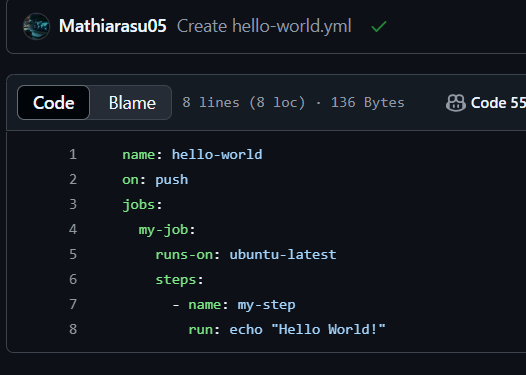
> 
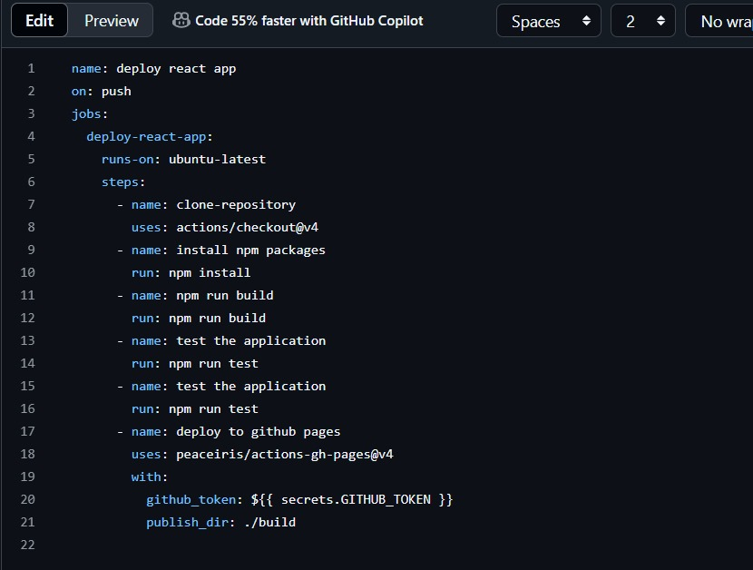

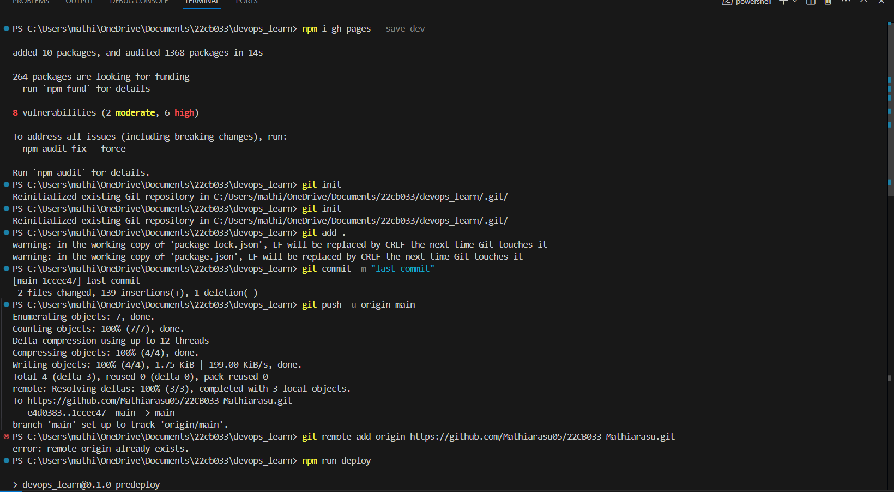
> Commands are used to deploye in github pages

>Website Deployed 

[website link git pages ](https://mathiarasu05.github.io/22CB033-Mathiarasu/)

***

#### #5 [AWS] Create the below mentioned AWS services
	- IAM
	- S3
	- CloudFront
> IAM and S3 services created pic

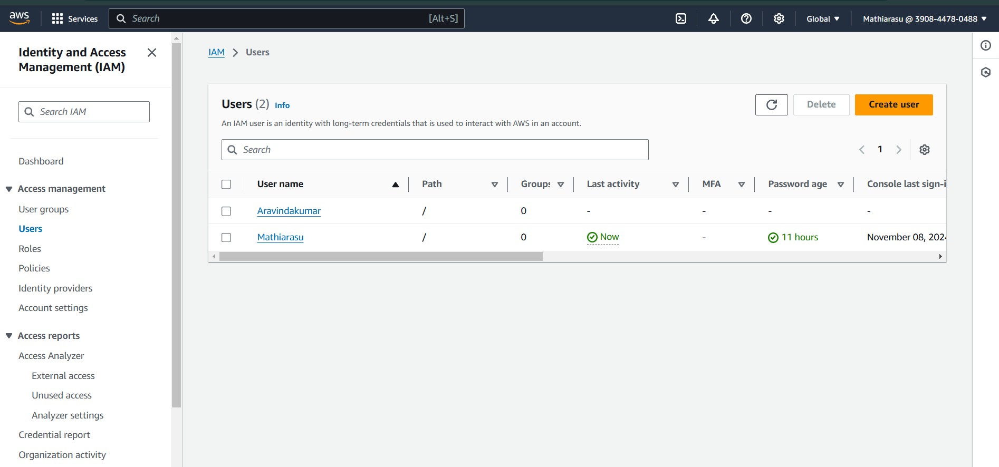
>IAM

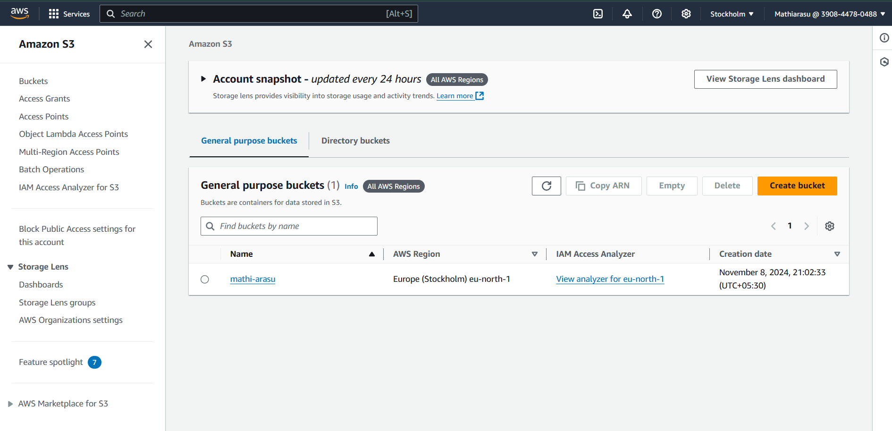
>S3 

***

#### #6 [AWS] Deploy the app in S3 and access via CloudFront in manual way
> Deploy React Website using S3 

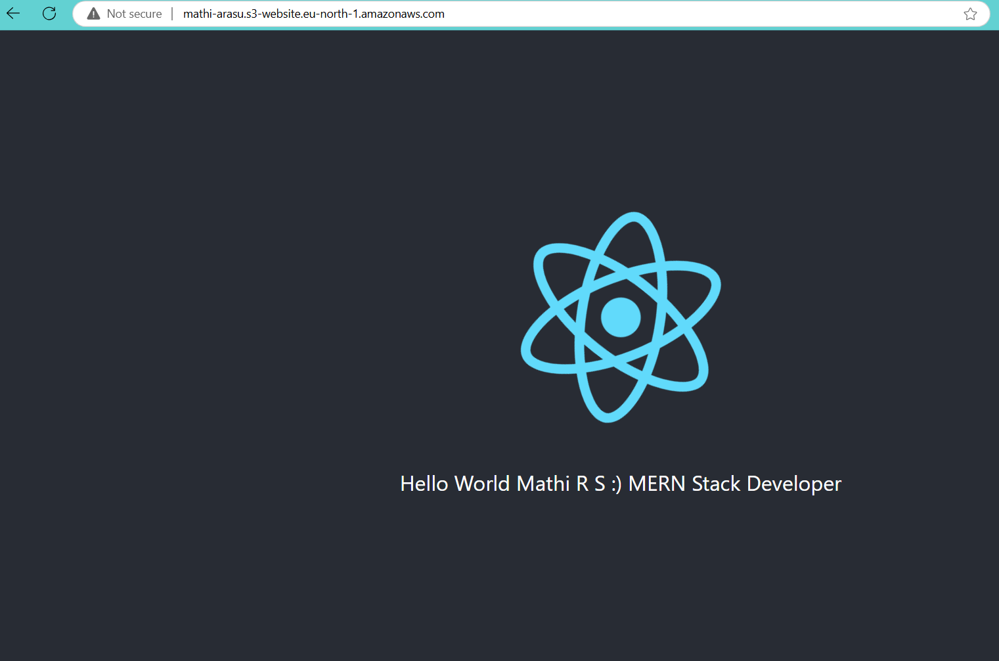

[webist link s3 ](http://mathi-arasu.s3-website.eu-north-1.amazonaws.com)

http://mathi-arasu.s3-website.eu-north-1.amazonaws.com

[cloudFront URL](https://db1mqf1i0ppyl.cloudfront.net/)

***

#### #7 [Github Actions] Create a Github Actions pipeline to deploy the app in AWS (S3 + CloudFront)
> Add your answer here!

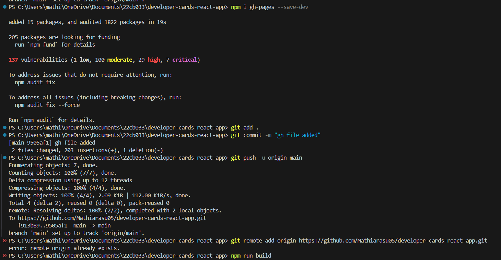
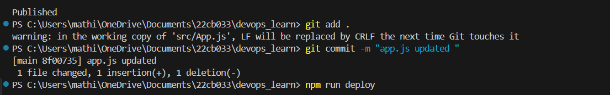

[webist link s3 services ](http://mathi-arasu.s3-website.eu-north-1.amazonaws.com)

[cloudFront URL](https://db1mqf1i0ppyl.cloudfront.net/)

***

#### #8 [Impromptu Learning] Write a Dev.to post for the given tool:
	- DevSecOps Periodic Table
	- Rules:
		Overview of the Tool
		Key Features
		How It Fits into DevOps/DevSecOps
		Programming Langauage
		Parent Company of that tool
		Whether it is open source or paid one
		Icon / Logo
> BLOG LINK 

[Visit my Dev.to article about MIRO ](https://dev.to/mathiarasu/miro-kbk)

***

#### #9 [Homework] Create the similar pipeline for the repo : https://github.com/SanthoshNC/developer-cards-react-app
	- Github Repo URL
	- Github Actions Pipeline for Github Pages
	- Github Pages URL
 	- Github Actions for S3
 	- AWS CloudFront URL

[repo link](https://github.com/Mathiarasu05/developer-cards-react-app)

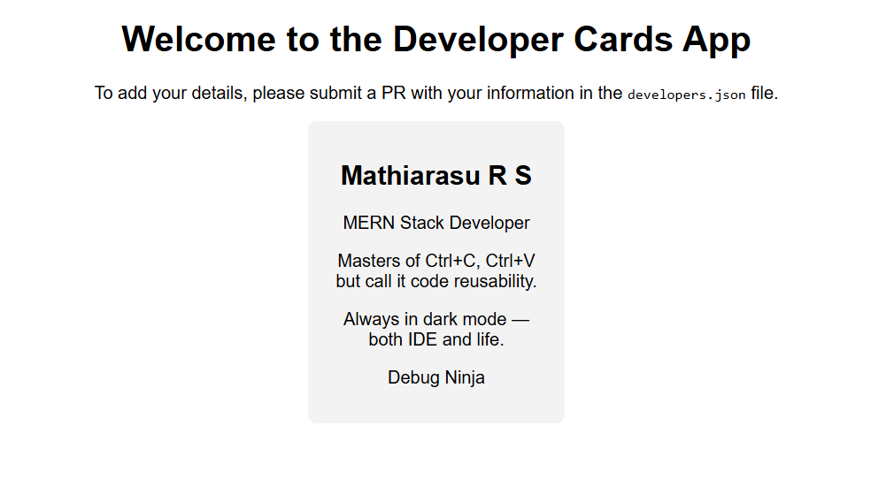
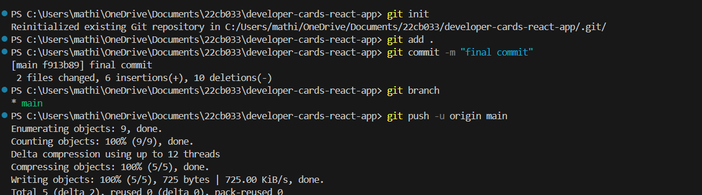

>pipe line actions

[GITHUB Page URL ](https://mathiarasu05.github.io/developer-cards-react-app/)

>IAM

>S3 

[webist link s3 services ](http://mathi-arasu.s3-website.eu-north-1.amazonaws.com)

[cloudFront URL](https://db1mqf1i0ppyl.cloudfront.net/)
>Thank You.....!

>Crafted by Mathiarasu R S 22CB033 🎯

***
